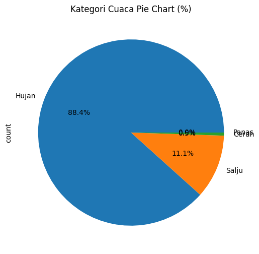
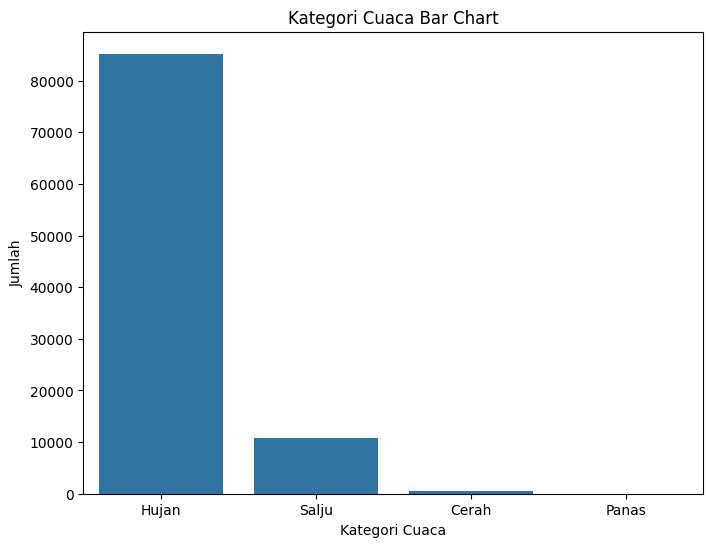
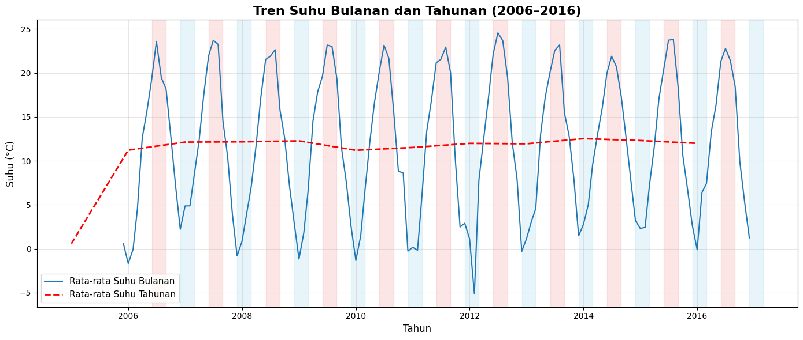

# 🌦️ Weather Classification and Climate Trend Summarization

## 📌 Gambaran Umum
Proyek ini bertujuan untuk menganalisis data cuaca historis dari tahun 2006 hingga 2016 menggunakan dataset publik **WeatherHistory.csv**.  
Langkah utama yang dilakukan meliputi klasifikasi kondisi cuaca (hujan, salju, cerah, panas) serta analisis tren suhu tahunan.  

Selain analisis manual, saya juga memanfaatkan bantuan **AI (Meta Llama-3 70B via Replicate)** untuk merangkum tren dan memberikan insight singkat sehingga hasil analisis lebih mudah dipahami.

---

## 📊 Dataset
- **Sumber:** [Kaggle – Weather History Dataset](https://www.kaggle.com/datasets/muthuj7/weather-dataset)  
- **Isi Data:** catatan cuaca harian 2006–2016 (suhu, kelembapan, presipitasi, tekanan udara, kecepatan angin, ringkasan cuaca).  
- **Ukuran File:** ~16 MB (CSV format).  

---

## 🔎 Proses Analisis
1. **Persiapan Data**  
   - Membaca dataset dengan Pandas.  
   - Membersihkan nilai kosong & mengubah format tanggal.  

2. **Eksplorasi Data**  
   - Melihat statistik sederhana (rata-rata, maksimum, minimum).  
   - Membuat visualisasi tren suhu tahunan & distribusi kategori cuaca.  

3. **Klasifikasi Cuaca**  
   Data dikelompokkan menjadi 4 kategori:  
   - Hujan 🌧️  
   - Salju ❄️  
   - Cerah ☀️  
   - Panas 🔥  

4. **Ringkasan dengan AI**  
   - Data suhu tahunan diberikan ke model AI.  
   - AI menghasilkan ringkasan tren, insight, dan rekomendasi singkat.  

---

## 📈 Visualisasi
### Distribusi Kategori Cuaca
- Sebagian besar data didominasi oleh **Hujan (88,4%)**, diikuti oleh **Salju (11,1%)**, sementara **Cerah** dan **Panas** hanya sebagian kecil.  

### 📊 Pie Chart:  
  

### 📊 Bar Chart:  
  

---

### Tren Suhu Bulanan & Tahunan
Grafik berikut memperlihatkan fluktuasi musiman suhu rata-rata bulanan serta tren rata-rata tahunan:  
  

---

## 💡 Hasil & Temuan
### Ringkasan Tren (AI)  
> “Secara umum suhu tahunan mengalami kenaikan dari 2006 hingga mencapai puncaknya di 2014 (12.53°C). Setelah itu terjadi sedikit penurunan di 2015–2016, namun suhu tetap lebih tinggi dibandingkan tahun-tahun awal.”  

### Insight Utama  
- Tahun terpanas: **2014 (~12,5°C rata-rata tahunan, 39°C maksimum harian)**.  
- Ada tren kenaikan konsisten dari 2006–2014.  
- Setelah 2015, suhu menurun sedikit tetapi tetap lebih tinggi dibandingkan 2006.  
- Fluktuasi musiman sangat jelas: suhu lebih tinggi di musim panas (Juni–Agustus), lebih rendah di musim dingin (Des–Feb).  

---

## ✅ Kesimpulan & Rekomendasi
- **Kesimpulan:**      
  - Suhu tahunan menunjukkan tren pemanasan jangka panjang
  - Puncak suhu tahunan terjadi di 2014 (~12,5°C)
  - Setelah 2015, tren menurun sedikit tapi tetap lebih tinggi dibanding 2006
  

- **Rekomendasi:**  
  - 🌍 Lanjutkan pemantauan jangka panjang untuk melihat dampak perubahan iklim.  
  - 👩‍🌾 Sektor pertanian sebaiknya menyesuaikan jadwal tanam dengan pola suhu baru.  
  - 🏙️ Pemerintah dan masyarakat perlu meningkatkan kesadaran terhadap risiko kesehatan akibat gelombang panas.  

---

## 🤖 Peran AI
- Model AI: **Meta Llama-3 70B (Replicate)**.  
- Kontribusi AI:  
  - Membuat ringkasan tren suhu tahunan.  
  - Menghasilkan insight utama & rekomendasi.  
  - Membantu mempercepat interpretasi data.  

---

## 📤 Hasil Proyek
- 📒 **Notebook (Google Colab):** [https://colab.research.google.com/drive/1uHndk8BtH2SYwwWpWEPRcJum_TfgJ9R2?usp=sharing]  
- 📂 **Dataset:** [WeatherHistory.csv](https://www.kaggle.com/datasets/muthuj7/weather-dataset)  
- 🖼️ **Slide Presentasi (PPT/PDF):** [https://www.canva.com/design/DAGyRrhEy8w/kRn5zRZ2uAb_jGnRymaqUw/edit?utm_content=DAGyRrhEy8w&utm_campaign=designshare&utm_medium=link2&utm_source=sharebutton]  
- 💻 **GitHub Repository:** [https://github.com/GazaHaikal/weather-capstone]  

---

## ▶️ Cara Menjalankan Notebook
1. Clone repository atau buka notebook di Google Colab.  
2. Pastikan library berikut sudah terinstall: `pandas`, `matplotlib`, `seaborn`, `replicate`, `python-dotenv`.  
3. Buat file .env di folder project lalu upload ke google drive dengan isi seperti berikut:
<pre>REPLICATE_API_TOKEN=your_api_key_here </pre>

👉 Ganti your_api_key_here dengan token asli dari Replicate API Tokens.
Jika tidak ingin menggunakan .env, kamu bisa memasukkan API token secara manual saat diminta di notebook.

4. Jalankan setiap sel untuk reproduksi analisis.  

